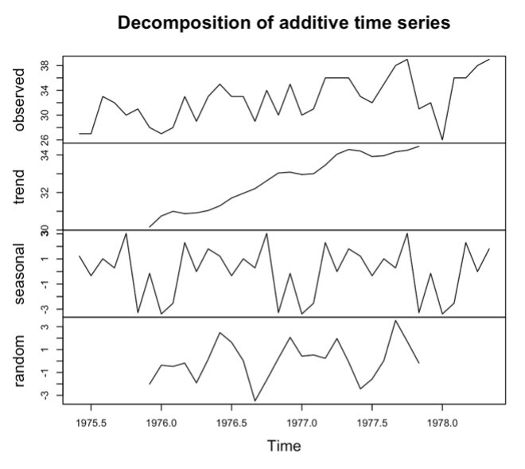
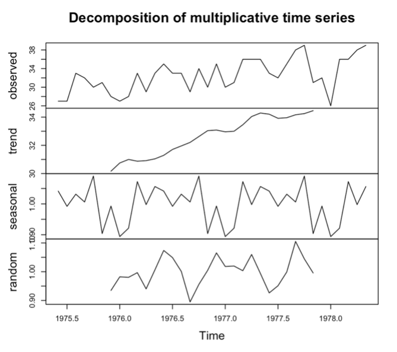
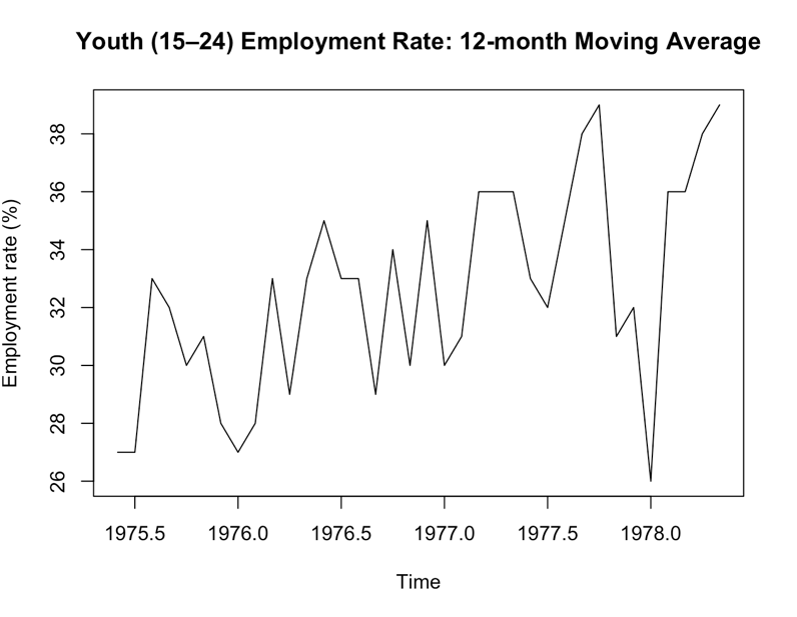
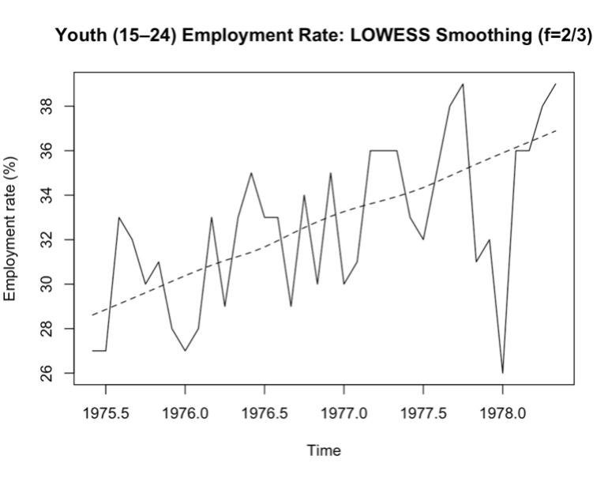
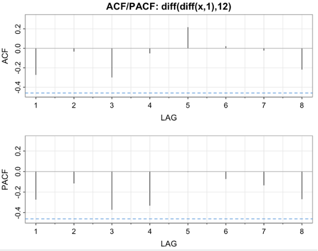
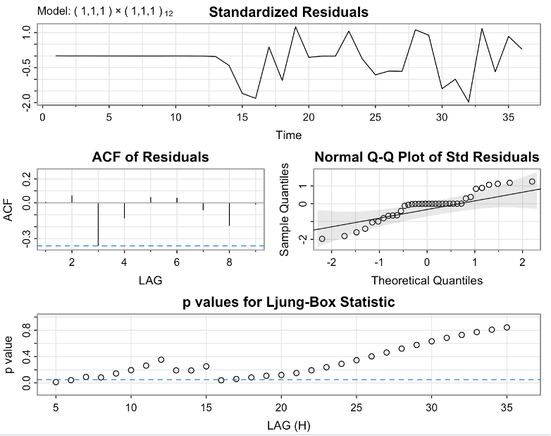
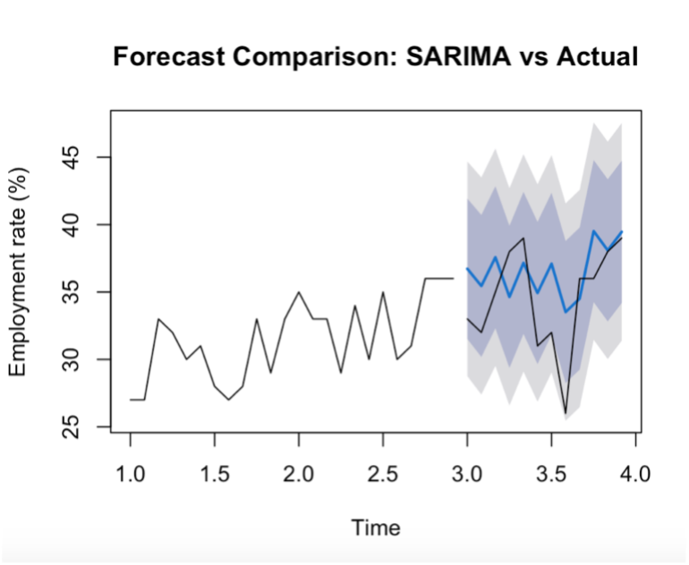
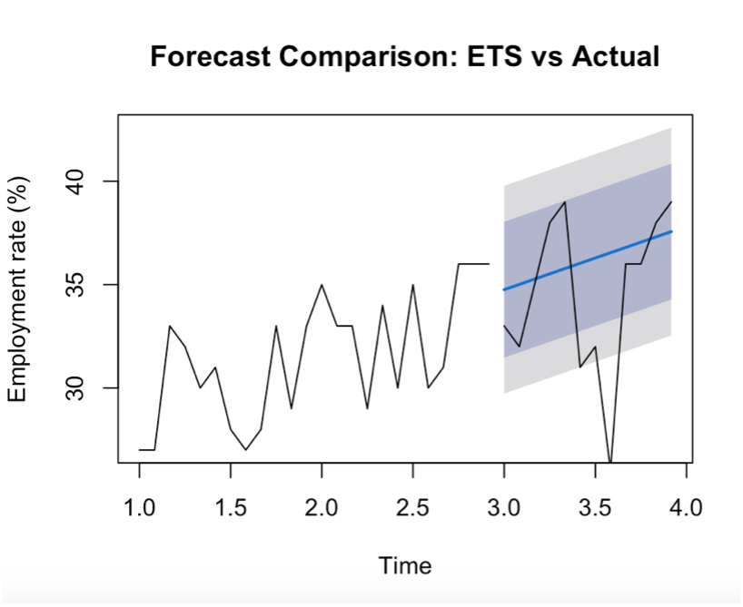

# youth-employment-time-series
# Youth Employment Rate Forecasting (Türkiye)

   This paper has sought to analyze the monthly youth (15-24) employment rate in Türkiye through applied time series methods. The analysis was initiated with the exploratory examination of the data, and it detected that, generally, a long-term upward trend was accompanied by short-term fluctuations, with a sharp decline at the beginning of 2020, which is most likely to reflect an extraordinary economic shock. Seasonal effects are relatively weak compared to trend and irregular components.
   Additive and multiplicative decomposition, together with smoothing methods, such as moving averages and LOWESS, were applied to better understand the underlying structure of the series. These methods consistently highlighted a gradual improvement in youth employment over time while filtering out short-term noise.
   In order to formally model the series, stationarity was induced through both first and   seasonal differencing. The ACF and PACF analyses of the differenced series suggested that a low-order seasonal ARIMA model was appropriate. A set of candidate SARIMA models had been estimated and compared based on information criteria and residual diagnostics. Based on parsimony and goodness of fit considerations, as well as the diagnostic results, the SARIMA(1,1,1)(0,1,1)[12] model was finally chosen.
   Residual diagnostics were performed, confirming that the selected model captured the dependence structure of the data, residuals behaving like white noise, and no significant remaining autocorrelation. Then, this model was used to obtain short-term forecasts, giving a reasonable outlook of future developments in youth employment rates. By and large, the results obtained prove that SARIMA models are effective tools for modeling and forecasting labor market indicators with trend and seasonal dynamics.

## Methods
- Decomposition
- Moving Average & LOWESS smoothing
- SARIMA modeling + diagnostics
- Forecasting
- SARIMA vs ETS comparison (MAE/RMSE/MAPE)

## Repo structure
- `src/analysis.R` : analysis code
- `outputs/` : plots and metrics
- `data/` 
  
## 📊 Visual Results

### Raw Youth Employment Rate

The raw monthly youth (15–24) employment rate time series exhibits noticeable medium- and long-term fluctuations over the sample period. Overall, the series shows an upward tendency from the mid-2000s to the late 2010s, indicating an improvement in youth employment conditions. A sharp decline is observed around 2020, which likely reflects the impact of a major economic shock on the labor market. Following this drop, the employment rate recovers strongly in subsequent years and reaches its highest levels toward the end of the sample.

### Decomposition (Additive)

### Decomposition (Multiplicative)

The additive and multiplicative decompositions appear visually very similar. This is expected because the employment rate series is measured in percentages and varies within a relatively narrow range. Moreover, the magnitude of seasonal fluctuations remains stable over time and does not depend on the level of the series. 

Although the additive and multiplicative decompositions look visually similar, the additive model is more appropriate for the youth employment rate series. The employment rate is expressed as a percentage and varies within a limited range, which implies that seasonal fluctuations have a relatively constant magnitude over time. In contrast, a multiplicative structure would imply that seasonal effects increase proportionally with the level of the series, which is not supported by the data. Therefore, the additive decomposition provides a more realistic and interpretable representation of the underlying components.

### Smoothing

<b>12-Month Moving Average</b> 

The 12-month moving average smooths short-term and seasonal fluctuations in the youth employment rate series, allowing the underlying medium-term trend to become more visible. The smoothed series indicates a general upward movement in employment over time, with temporary declines occurring during certain periods. A pronounced drop is observed around 2020, followed by a strong recovery, which suggests that the shock was temporary rather than structural.

<b>LOWESS Smoothing</b> 

The figure displays the original youth (15–24) employment rate series together with a LOWESS-smoothed curve (f = 2/3). The original series exhibits substantial short-term variability and irregular fluctuations. In contrast, the LOWESS curve smooths these local variations and reveals a clear underlying upward trend over time. The comparison highlights how LOWESS effectively captures gradual changes in the employment rate while filtering out high-frequency noise

### Model Identification (ACF / PACF)

After applying both first and seasonal differencing, the ACF and PACF plots show rapidly decaying autocorrelations with only a few significant spikes at low lags. This indicates that the series is stationary and that a low-order SARIMA model, such as SARIMA(1,1,1)(0,1,1)[12], is appropriate.

---

### SARIMA Residual Diagnostics

  Four  SARIMA models were estimated and compared using information criteria and residual diagnostics. Among the candidate models, m1 = SARIMA(1,1,1)(0,1,1)[12] produced the lowest information criteria values (IC ≈ 5.70) compared to m2, m3, and m4. Although m4 includes additional seasonal parameters, it does not provide a meaningful improvement in fit and introduces unnecessary complexity.
   Residual diagnostics for m1 show that standardized residuals fluctuate around zero with no clear pattern. The residual ACF is largely within the confidence bounds, and Ljung–Box test p-values exceed 0.05 at higher lags, indicating no significant remaining autocorrelation. The Q–Q plot suggests approximate normality with minor deviations at the tails.
  
 Based on parsimony, goodness of fit, and residual diagnostics, SARIMA (1,1,1) (0,1,1)[12]
was selected as the final model.

---

### Forecasting Results

<b>SARIMA vs Actual</b> 

The figure compares the 12-month ahead SARIMA forecasts with the actual youth employment rate observations. The forecasted values follow the general upward movement of the series and successfully capture the overall level and direction of change. Although short-term fluctuations are smoothed, most observed values remain within the prediction intervals, indicating that the SARIMA model provides an adequate and reliable representation of the underlying dynamics of the employment rate series.

<b>ETS vs Actual</b> 

The ETS forecast plot shows that the exponential smoothing model closely tracks recent changes in the employment rate and adapts rapidly to short-term variations. The predicted values follow the observed series more tightly, particularly in periods of sudden movements. This suggests that ETS effectively captures local dynamics and may provide superior short-term forecasting performance compared to a purely ARIMA-based structure.

